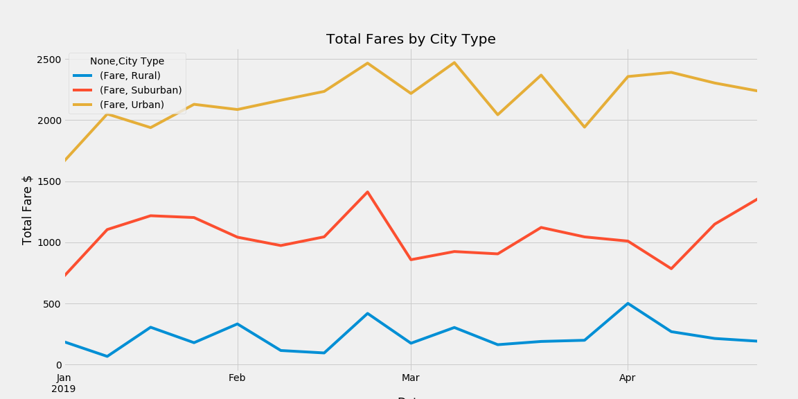

# PyBer_Analysis
Project analysis for Data Analytics Certificate course using Python 3, Jupyter Notebook, and Matplotlib.

## Challenge
This assignment was a part of UC Berkeley's Data Analytics Bootcamp. In the assignment, I was put in the scenario of working for a ride-sharing app and asked to analyze data and create visualizations by using Python, Jupyter Notebook, Matplotlib, Pandas. SciPy and NumPy. In this challenge, I used city data and rider data to create a data frame showing all the data by the type of city- rural, suburban or urban. The analysis shows that the Pyber ride share company is overwhelming used in urban cities compared to suburban and rural cities but the average fare for rural cities is significantly higher. Please see the table and chart below. 
|          |   Total Rides |   Total Drivers | Total Fares   | Average Fare per Ride   | Average Fare per Driver   |
|:---------|--------------:|----------------:|:--------------|:------------------------|:--------------------------|
| Rural    |           125 |              78 | $4,327.93     | $34.62                  | $55.49                    |
| Suburban |           625 |             490 | $19,356.33    | $30.97                  | $39.50                    |
| Urban    |          1625 |            2405 | $39,854.38    | $24.53                  | $16.57                    |

